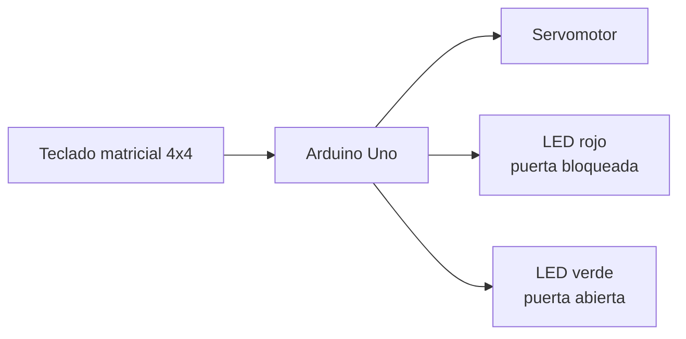
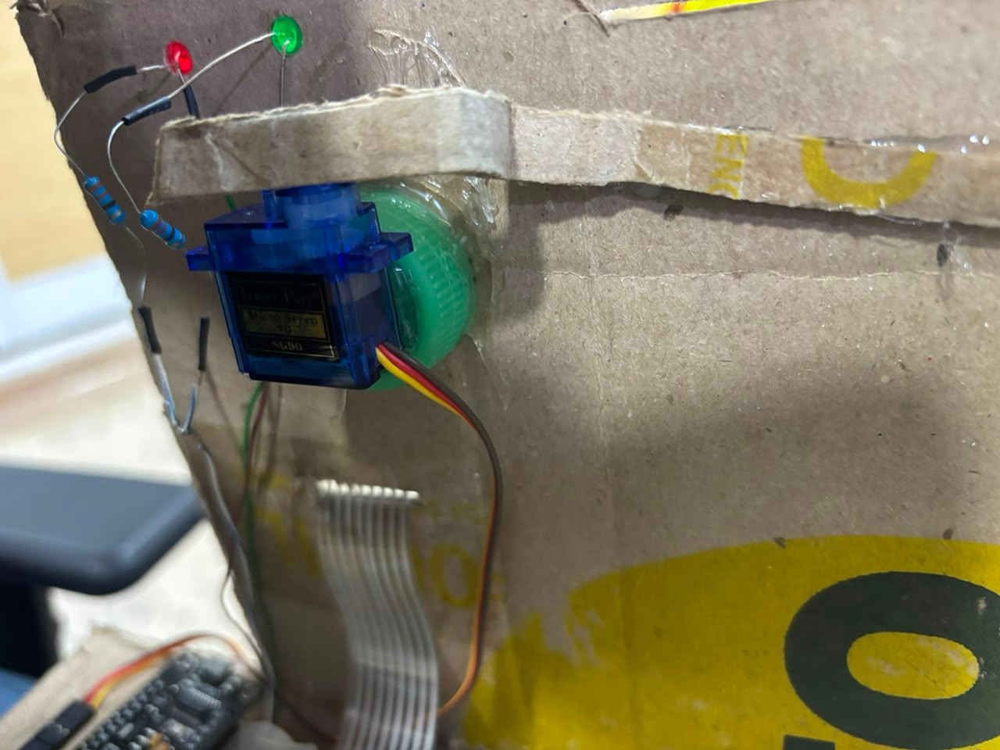
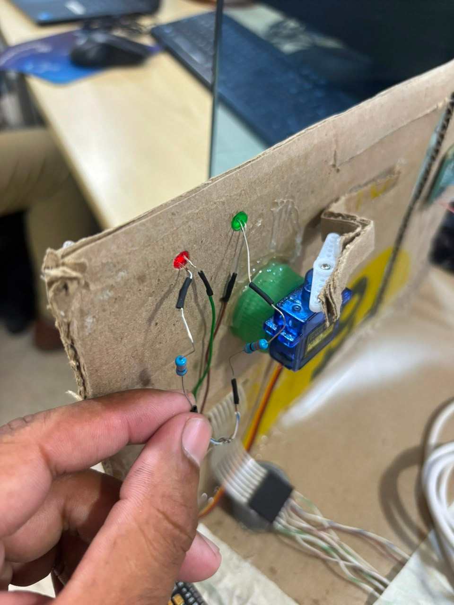
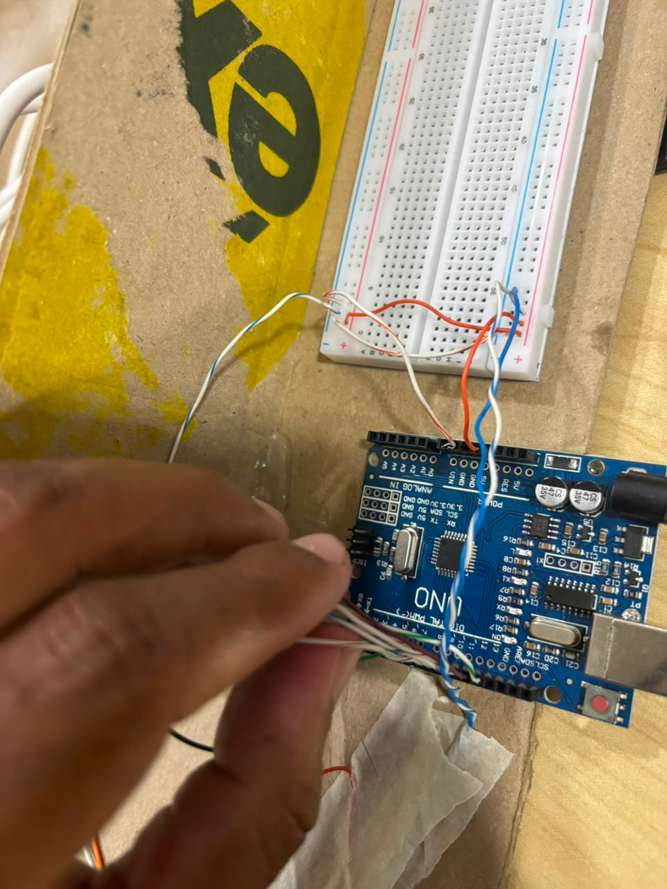
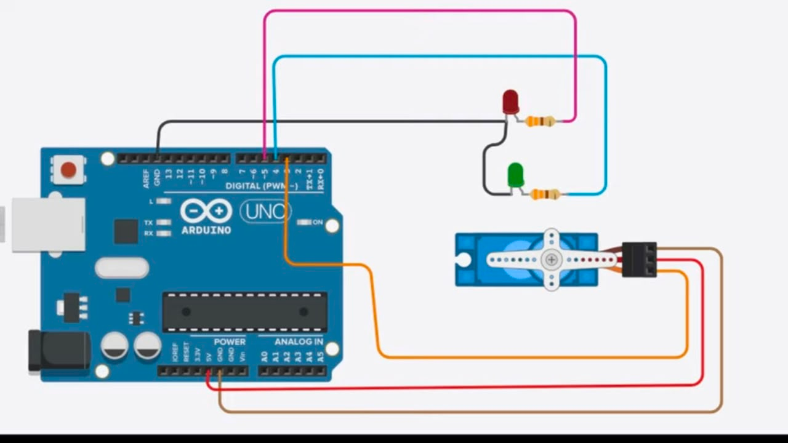

# Puerta automática de contraseña numeral

## Integrantes

- Samuel Gutierrez
- Hernández Sharyd
- Cheiner Ojeda
- Aly Rivera
- Jhon Guette
- yojaner sanjuan

## Descripción del proyecto

Este proyecto consiste en un sistema automático de seguridad que permite ingresar personas si tienen la validación mediante el ingreso de dígitos, procesa la información con un microcontrolador Arduino Uno y activa un servomotor que abre la puerta si el número es correcto. El sistema no permite robos y aumenta la seguridad de las instalaciones.

## Problema identificado

Queremos resolver la inseguridad de diferentes instalaciones tales como casas, almacenes, empresas, etc. Muchas instalaciones sufren de diferentes problemas con el robo de objetos, por ende deseamos mejorar eso haciéndolo al menos un poco seguro para que ya no se sufra el tener miedo ante estas situaciones.

## Objetivo general

Diseñar e implementar un sistema de control de acceso mediante teclado matricial que valide una contraseña y accione un servomotor para la apertura automática de una puerta.

## Objetivos específicos

- Leer la entrada del teclado matricial 4×4 y registrar los caracteres ingresados por el usuario.
- Implementar una lógica de validación que compare la clave ingresada con una contraseña predefinida.
- Controlar un servomotor para abrir y cerrar la puerta según el resultado de la validación.
- Indicar visualmente el estado del sistema mediante LEDs rojo (bloqueado) y verde (abierto).
- Verificar el funcionamiento del prototipo mediante pruebas de ingreso correcto, incorrecto y borrado de clave.

## Componentes utilizados

| Componente | Cantidad | Función |
|---|---|---:|
| Arduino Uno | 1 | Controlador principal |
| Teclado matricial 4x4 | 1 | Ingreso de la contraseña |
| Servomotor | 1 | Apertura y cierre de la puerta |
| LED rojo | 1 | Indicador de puerta bloqueada |
| LED verde | 1 | Indicador de puerta abierta |
| Resistencias | Varias | Protección de LEDs |
| Cables y protoboard | Varios | Conexión del circuito |
| Fuente de alimentación | 1 | Alimentación del sistema |

## Arquitectura del sistema

## Funcionamiento

El sistema funciona como una cerradura electrónica de seguridad. El usuario debe introducir una contraseña de 4 caracteres a través del teclado para accionar el servomotor que abre la puerta.

1. **Estado inicial (reposo):** Al encenderse, el sistema se inicializa y el servomotor se coloca en la posición de puerta cerrada (9°). El LED rojo se mantiene encendido indicando que la puerta está bloqueada.

2. **Ingreso de la clave:** El usuario presiona los caracteres de la contraseña. Mientras escribe, el sistema oculta los caracteres en el monitor serial mostrando `*`. Si el usuario se equivoca, puede presionar `*` para borrar todo y empezar de nuevo.

3. **Verificación:** Al terminar de escribir, el usuario presiona `#` para enviar la clave. El Arduino compara la clave ingresada con la clave almacenada en el código.

4. **Clave correcta:** El sistema activa el LED verde y apaga el LED rojo. El servomotor gira desde la posición de cerrado (9°) hasta la posición de abierto (130°) en pasos de 10°. La puerta permanece abierta 5 segundos, luego el servomotor regresa a la posición de cerrado. El LED rojo se enciende nuevamente.

5. **Clave incorrecta:** El sistema no activa el servomotor. Se reinicia el campo de ingreso y pide al usuario que intente nuevamente.

## Evidencias del proyecto

### Fotos

### Videos

[Ver video de funcionamiento](docs/videos/video_funcional.mp4)

## Código fuente

El código principal se encuentra en la carpeta `codigo/control_puerta/`. Utiliza las librerías `Servo.h` para el control del motor y `Keypad.h` para la lectura del teclado matricial. La contraseña por defecto es `ABCD` (presionando las teclas en la última fila del teclado).

[Ver código principal](codigo/control_puerta/control_puerta.ino)

## Esquema de conexiones

| Componente | Pin Arduino |
|---|---|
| Servomotor | Pin 3 |
| LED rojo | Pin 4 |
| LED verde | Pin 5 |
| Teclado fila 1 | Pin 9 |
| Teclado fila 2 | Pin 8 |
| Teclado fila 3 | Pin 7 |
| Teclado fila 4 | Pin 6 |
| Teclado columna 1 | Pin 10 |
| Teclado columna 2 | Pin 11 |
| Teclado columna 3 | Pin 12 |
| Teclado columna 4 | Pin 13 |

## Pruebas realizadas

| Prueba | Descripción | Resultado |
|---|---|---|
| Lectura del teclado | Se presionaron todas las teclas verificando la matriz | Cada tecla corresponde al carácter esperado |
| Apertura con clave correcta | Se ingresó la clave ABCD y se presionó # | El servomotor giró a 130° correctamente |
| Bloqueo con clave incorrecta | Se ingresó una clave errónea | El servomotor no se activó |
| Cierre automático | Se esperaron los 5 segundos después de abrir | El servomotor regresó a 9° |
| Borrado con * | Se presionó * durante el ingreso | El campo se reinició correctamente |

## Estado actual del proyecto

El proyecto se encuentra en fase de pruebas. El sistema ya valida la contraseña y acciona el servomotor correctamente.

## Dificultades encontradas

- **Mapeo del teclado matricial:** Durante el diagnóstico con el Monitor Serial, se ajustó la matriz de caracteres del teclado para que coincidiera con el orden físico de los cables, garantizando la correspondencia correcta entre tecla presionada y carácter leído.
- **Integración de pantalla LCD:** Se intentó incorporar una pantalla LCD 16×2 para mejorar la interfaz con el usuario, sin embargo no se disponía del potenciómetro de contraste necesario para ajustar el brillo y la visualización de los caracteres, por lo que la pantalla no pudo integrarse en el prototipo final.
- **Migración a ESP32:** Se evaluó la migración del sistema a un microcontrolador ESP32 con el fin de habilitar conectividad inalámbrica y monitoreo remoto. No obstante, la integración quedó pendiente debido a las dificultades con la pantalla LCD y la necesidad de ajustar la lógica de control para los pines del nuevo dispositivo.

## Mejoras futuras

- Implementar una contraseña numérica en lugar de alfanumérica.
- Integrar pantalla LCD 16×2 con potenciómetro de contraste para mostrar mensajes de estado al usuario.
- Migrar a ESP32 para habilitar monitoreo remoto y registro de accesos en la nube.
- Desarrollar una plataforma web que permita administrar el sistema de acceso, visualizar registros de entrada y gestionar usuarios de forma remota.
- Implementar generación de códigos de acceso aleatorios y temporales, que puedan asignarse a visitantes o entregas sin necesidad de compartir la clave maestra.
- Agregar respaldo con batería para operación ininterrumpida.
- Implementar apertura por Bluetooth como método alternativo de desbloqueo.

## Conclusiones

El proyecto permitió integrar un teclado matricial, un servomotor y programación de microcontroladores para resolver una necesidad real de seguridad. Se comprobó que es posible controlar el acceso a una instalación mediante una lógica de validación de contraseña con Arduino Uno.
